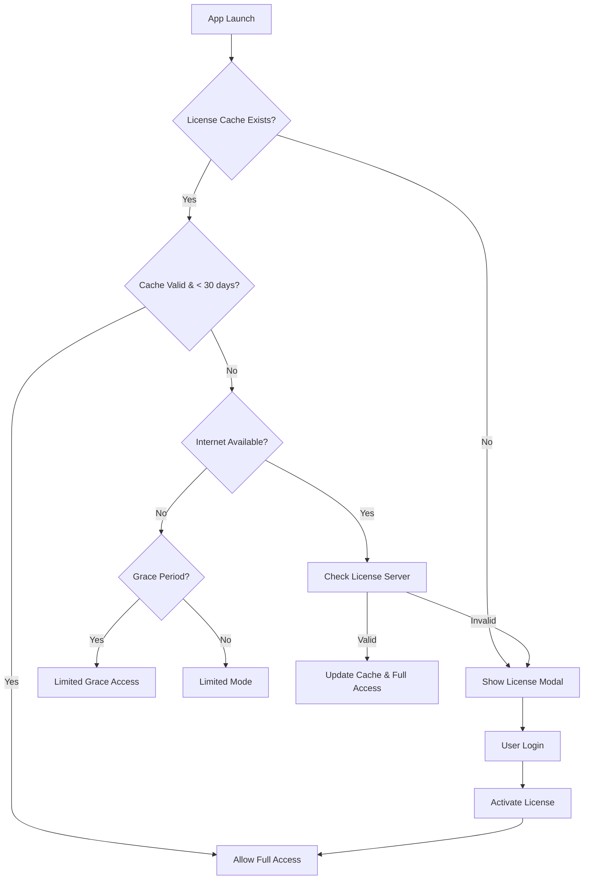

# OpenScribe Licensing System

This document outlines the comprehensive licensing system implemented for OpenScribe, enabling monthly subscription management with offline support.

## 🏗️ System Architecture

### Core Components

1. **LicenseService** (`src/main/services/LicenseService.ts`)
   - Main orchestrator for license validation
   - Handles online/offline validation flow
   - Manages app state transitions
   - Feature access control

2. **AuthService** (`src/main/services/AuthService.ts`)
   - User authentication with your license server
   - Token caching and validation
   - License token generation for offline use

3. **SubscriptionService** (`src/main/services/SubscriptionService.ts`)
   - Subscription status checking
   - Machine registration/deregistration
   - Billing portal integration

4. **OfflineLicenseManager** (`src/main/security/OfflineLicenseManager.ts`)
   - Encrypted license caching
   - Offline validation logic
   - Grace period management

5. **MachineIdGenerator** (`src/main/security/MachineIdGenerator.ts`)
   - Unique machine identification
   - Cross-platform hardware fingerprinting
   - Consistent machine ID generation

## 🔄 License Validation Flow



## 📱 App States

- **LICENSED**: Full access to all features
- **TRIAL**: Trial period with full features
- **GRACE_PERIOD**: Past due but in 7-day grace period
- **LIMITED**: Basic functionality only
- **UNLICENSED**: No license, login required

## 🛡️ Security Features

### Machine ID Generation
- Uses hardware UUID, CPU info, hostname, and volume serial
- Cross-platform compatible (Windows, macOS, Linux)
- Consistent across app restarts
- Fallback mechanisms for different environments

### Encrypted License Caching
- AES-256-CBC encryption for local license storage
- Tamper-resistant token signatures
- Automatic cache invalidation on corruption

### Offline Support
- 7-day grace period for offline use
- Monthly validation requirement
- Encrypted local token storage
- Gradual feature restriction approach

## 🔧 Implementation Setup

### 1. Initialize License Service in Main Process

```typescript
// In your main.ts file
import { LicenseService } from './services/LicenseService';

app.whenReady().then(async () => {
  const licenseService = LicenseService.getInstance();
  await licenseService.initialize();
  licenseService.startPeriodicValidation();
  
  // ... rest of your app initialization
});
```

### 2. Integrate License UI in Renderer

```typescript
// In your main App component
import { LicenseModal } from './components/LicenseModal';
import { LICENSE_IPC_CHANNELS } from '../shared/constants/license-constants';

function App() {
  const [showLicenseModal, setShowLicenseModal] = useState(false);
  const [appState, setAppState] = useState('unlicensed');

  useEffect(() => {
    // Check license on app start
    window.electronAPI.checkLicense().then(result => {
      if (!result.isValid) {
        setShowLicenseModal(true);
      }
    });

    // Listen for license status changes
    const cleanup = window.electronAPI.onLicenseStatusChanged((status) => {
      setAppState(status.state);
      if (status.state === 'unlicensed') {
        setShowLicenseModal(true);
      }
    });

    return cleanup;
  }, []);

  return (
    <div className="app">
      {/* Your app content */}
      
      <LicenseModal
        isOpen={showLicenseModal}
        onClose={() => setShowLicenseModal(false)}
        onLicenseActivated={() => {
          setShowLicenseModal(false);
          setAppState('licensed');
        }}
      />
    </div>
  );
}
```

### 3. Feature Access Control

```typescript
// Example usage in components
const licenseService = LicenseService.getInstance();

// Check if feature is allowed
if (licenseService.isFeatureAllowed('export')) {
  // Show export functionality
} else {
  // Show upgrade prompt
}

// Get current restrictions
const restrictions = licenseService.getFeatureRestrictions();
if (restrictions) {
  console.log('Max projects:', restrictions.maxProjects);
  console.log('Export formats:', restrictions.exportFormats);
}
```

## 🌐 License Server Requirements

Your license server needs to implement these endpoints:

### Authentication
- `POST /auth/login` - User login
- `POST /auth/validate` - Token validation

### Subscription Management
- `POST /subscriptions/check` - Check subscription status
- `POST /subscriptions/cancel` - Cancel subscription
- `POST /subscriptions/billing-portal` - Get billing portal URL

### Machine Management
- `POST /machines/register` - Register new machine
- `POST /machines/deregister` - Remove machine
- `GET /machines/:userId` - Get user's machines

### Example Server Response Formats

```typescript
// /auth/login response
{
  success: true,
  user: {
    id: "user123",
    email: "user@example.com",
    name: "John Doe",
    subscription: {
      status: "active",
      currentPeriodEnd: "2025-02-18T00:00:00Z",
      cancelAtPeriodEnd: false,
      planId: "monthly_pro",
      planName: "Pro Monthly"
    },
    machineLimit: 2
  },
  token: "jwt_token_here"
}

// /subscriptions/check response
{
  isActive: true,
  subscription: { /* subscription object */ },
  machineRegistered: true,
  machinesUsed: 1,
  machineLimit: 2
}
```

## 🧪 Development & Testing

### Environment Variables
Create a `.env` file:
```
LICENSE_SERVER_URL=http://localhost:3001
NODE_ENV=development
```

### Testing Offline Mode
1. Start the app with internet connection
2. Login and activate license
3. Disconnect internet
4. Restart app - should work offline for 7 days

### Testing Grace Period
1. Simulate expired subscription on server
2. App should enter grace period mode
3. Features remain available with warnings

## 📋 Next Steps

### Immediate Implementation Tasks

1. **Set up License Server**
   - Choose hosting platform (AWS, Vercel, Railway)
   - Implement the required API endpoints
   - Set up Stripe/Paddle for billing
   - Configure user database

2. **Configure App Constants**
   - Update `LICENSE_SERVER_URL` in constants
   - Set machine limits per plan
   - Adjust grace period duration
   - Configure feature restrictions

3. **Testing & Validation**
   - Test all license states
   - Verify offline functionality
   - Test machine ID generation on target platforms
   - Validate security measures

4. **UI/UX Polish**
   - Design subscription status indicators
   - Create upgrade prompts
   - Add billing management UI
   - Implement trial period messaging

### Advanced Features to Consider

1. **Trial Management**
   - Automatic trial start for new users
   - Trial expiration handling
   - Feature limitations during trial

2. **Enhanced Security**
   - Certificate pinning for API calls
   - Additional tamper detection
   - Audit logging

3. **User Experience**
   - In-app billing flow
   - Subscription plan comparison
   - Usage analytics dashboard

4. **Business Intelligence**
   - License usage tracking
   - Churn prediction
   - Feature usage analytics

## 🚨 Important Security Notes

1. **Never store sensitive keys in client code**
2. **Always validate license server responses**
3. **Implement rate limiting on license checks**
4. **Use HTTPS for all license server communication**
5. **Regularly rotate signing keys**

## 📞 Integration Support

The licensing system is designed to integrate seamlessly with your existing OpenScribe codebase. Key integration points:

- **Project limits**: Check before creating new projects
- **Export restrictions**: Validate format availability
- **Recording limits**: Enforce time/step limits in limited mode
- **Feature gates**: Add license checks before premium features

The system provides both reactive (state-based) and proactive (check-based) approaches to license enforcement, giving you flexibility in how you implement restrictions. 